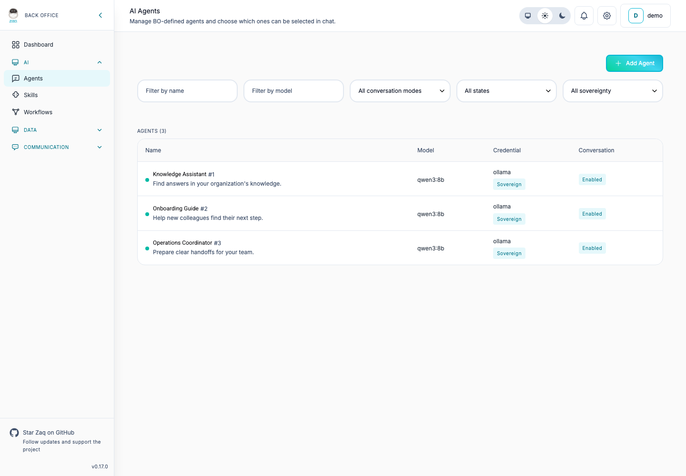
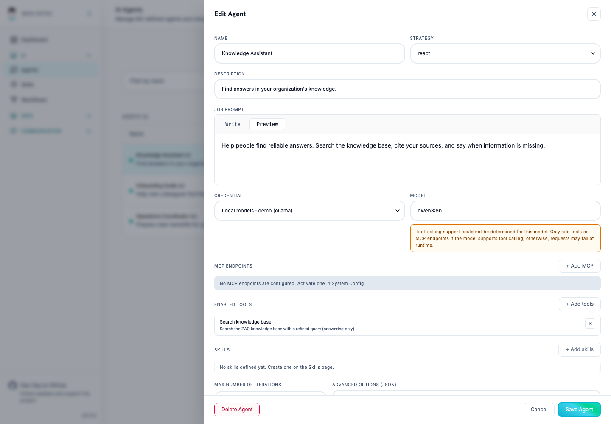
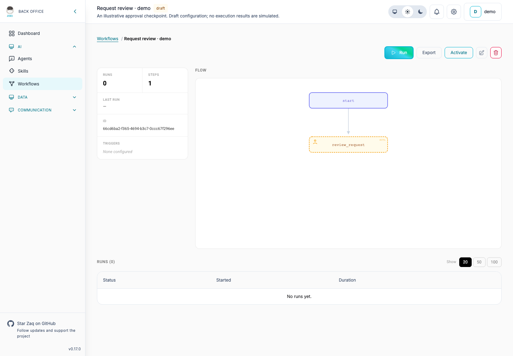

# ZAQ

### The collaborative agentic operating system.

Bring people, AI agents, knowledge, and workflows together—on your terms, with control over your data, models, and infrastructure.

[](https://coveralls.io/github/www-zaq-ai/zaq?branch=main)
[](https://discord.gg/rDUeWP5GbD)
[](https://www-zaq-ai.github.io/zaq/)

<!-- These repository links are absolute because ExDoc also publishes this README without the repository guides. -->
[Get started](#get-started) · [Documentation](https://github.com/www-zaq-ai/zaq/blob/main/docs/README.md) · [Contribute](https://github.com/www-zaq-ai/zaq/blob/main/CONTRIBUTING.md) · [Join the community](https://discord.gg/rDUeWP5GbD)

ZAQ is an open-source, self-hosted platform for working with AI agents across your organization. Configure agents for specific jobs, connect them to knowledge and tools, and coordinate their work through conversations and workflows—with people involved where decisions need human judgment.



*A shared place to manage agents with distinct responsibilities. All previews show the real interface with synthetic demo configuration—not production data or completed agent runs.*

## What you can do with ZAQ

### Give agents a job—and the tools to do it

Define an agent's instructions and model, select its tools, and attach reusable skills and MCP servers. Configure different agents for different responsibilities instead of relying on one assistant for everything.

### Put organizational knowledge to work

Connect data sources, ingest documents, and retrieve relevant context for answers with citations. Manage the knowledge behind your agents, not just their prompts.

### Bring people and agents into the same conversation

Work with agents in the built-in chat or through configured communication channels, including Mattermost and email. Connect conversations to the agents responsible for handling them. See the [channel guide](https://github.com/www-zaq-ai/zaq/blob/main/docs/services/channels.md) for integration details.

### Coordinate work beyond a single prompt

Compose workflows from agent and tool steps, add conditions and human approval checkpoints, and inspect individual runs. Workflows are an opt-in capability in production; see [deployment configuration](https://github.com/www-zaq-ai/zaq/blob/main/docs/operations/deployment.md#enable-workflows) and the [workflow authoring guide](https://github.com/www-zaq-ai/zaq/blob/main/docs/guides/workflows-guide.md).

### Choose where your AI runs

Self-host ZAQ and configure the model endpoints your organization uses. Manage people, roles, and access alongside your agents. Local and external providers can serve different needs; data sent to external models, tools, or integrations remains subject to those services' policies and your configuration.

## A closer look

### Configure how an agent works



*Define the job, choose a model, and select tools. The interface also provides MCP and skill assignment controls; this demo does not have either attached. Model capability warnings remain visible so configuration is not mistaken for verified runtime compatibility.*

### Keep people in the workflow



*An illustrative human-review checkpoint in a draft workflow. The flow and run history are shown together; this example has not been executed.*

## Get started

The quickest local path uses the installer on **macOS or Linux**, with **Docker and the Docker Compose plugin** installed and running. You also need Git to clone the repository.

```bash
git clone https://github.com/www-zaq-ai/zaq.git
cd zaq
./zaq-local.sh
```

The installer downloads its Compose configuration, generates local secrets, creates the storage folder, and starts the containers. It opens [localhost:4000](http://localhost:4000) and follows the logs. See the [installer details](https://github.com/www-zaq-ai/zaq/blob/main/docs/operations/deployment.md#local-auto-installer) for setup behavior and caveats.

### Make it yours

1. **Complete first-login setup.** Set the bootstrap administrator's email and a new password.
2. **Connect a model.** Configure your AI provider credentials and model settings in Back Office. The installer does not supply a local model server; you need a reachable provider or self-hosted endpoint.
3. **Configure an agent.** Give it a job, select a model, and enable the tools and skills it needs. Enable it for conversations to use it in chat.
4. **Add knowledge when you need it.** Configure embedding settings and a data source, then ingest documents. For the installer's mounted folder, first save the `documents` volume under **Data Sources → Disk**; creating the folder alone does not expose it to ZAQ.
5. **Start a conversation.** Open **Chat** and try your agent with a task suited to its configuration.

This is a **local HTTP quick start**, not a production deployment recipe. For a LAN or public server, follow the [deployment and HTTPS guide](https://github.com/www-zaq-ai/zaq/blob/main/docs/operations/deployment.md#production-deployment-and-https).

Prefer to build from source? See [local development](https://github.com/www-zaq-ai/zaq/blob/main/docs/dev-setup.md) or [Docker Compose](https://github.com/www-zaq-ai/zaq/blob/main/docs/operations/deployment.md#docker-compose).

## Documentation

| I want to… | Start here |
| --- | --- |
| Deploy and operate ZAQ | [Deployment, storage, and HTTPS](https://github.com/www-zaq-ai/zaq/blob/main/docs/operations/deployment.md) |
| Configure models and credentials | [System configuration](https://github.com/www-zaq-ai/zaq/blob/main/docs/services/system-config.md) |
| Connect communication channels and data sources | [Channels and integrations](https://github.com/www-zaq-ai/zaq/blob/main/docs/services/channels.md) |
| Configure agents, tools, skills, and MCP | [Agent guide](https://github.com/www-zaq-ai/zaq/blob/main/docs/services/agent.md) |
| Build workflows | [Workflow authoring](https://github.com/www-zaq-ai/zaq/blob/main/docs/guides/workflows-guide.md) |
| Understand the architecture | [Services and node roles](https://github.com/www-zaq-ai/zaq/blob/main/docs/architecture.md) |
| Develop or extend ZAQ | [Development setup](https://github.com/www-zaq-ai/zaq/blob/main/docs/dev-setup.md) · [Source map](https://github.com/www-zaq-ai/zaq/blob/main/docs/project.md) |

Browse the [full documentation index](https://github.com/www-zaq-ai/zaq/blob/main/docs/README.md) for repository-current guides, or the [published documentation](https://www-zaq-ai.github.io/zaq/) updated on releases.

ZAQ is built with [Elixir](https://elixir-lang.org/), [Phoenix](https://www.phoenixframework.org/), and [Phoenix LiveView](https://hexdocs.pm/phoenix_live_view), with PostgreSQL and pgvector for persistence and vector search.

## Community and contributing

Join the [ZAQ Discord](https://discord.gg/rDUeWP5GbD) to ask questions, share what you're building, and help shape the project. Report bugs or suggest improvements through [GitHub issues](https://github.com/www-zaq-ai/zaq/issues).

Contributions are welcome. Start with [CONTRIBUTING.md](https://github.com/www-zaq-ai/zaq/blob/main/CONTRIBUTING.md) for setup and the contribution process.

## License

ZAQ is dual-licensed:

- **Open source:** [GNU Affero General Public License v3.0](https://github.com/www-zaq-ai/zaq/blob/main/LICENSE).
- **Commercial:** alternative terms are available for organizations that need them. Contact [license@zaq.ai](mailto:license@zaq.ai).

Unless you have a separate commercial license agreement with ZAQ, your use of this repository is governed by the AGPLv3.
