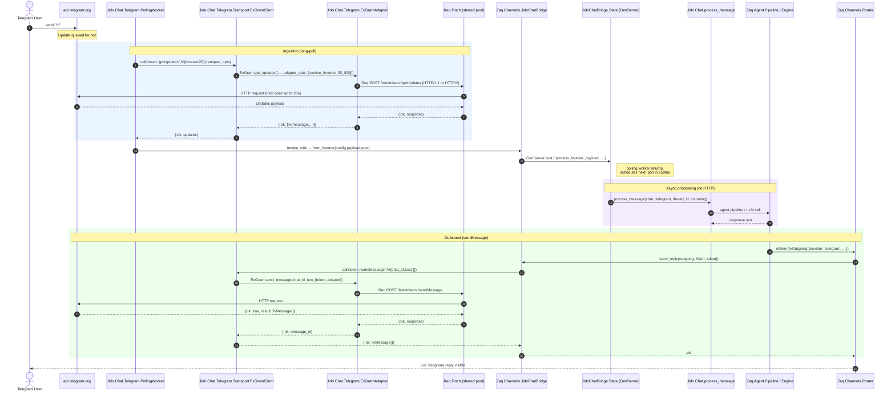
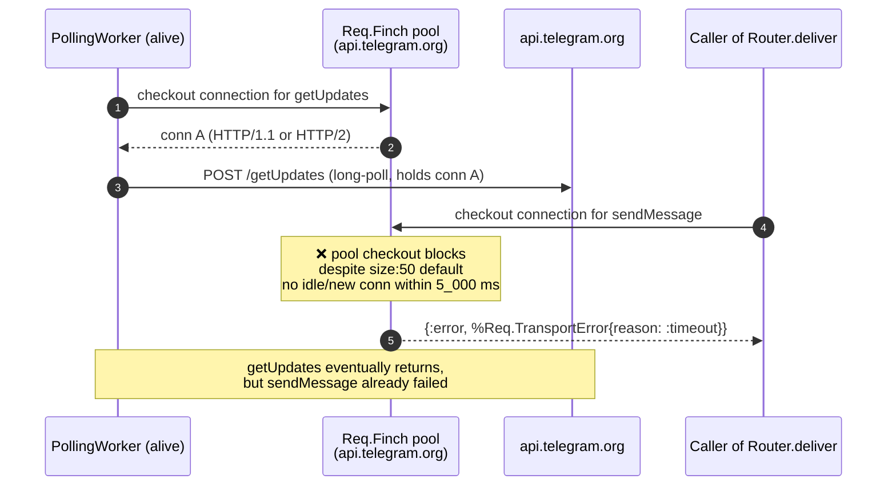

# Telegram Channel — Inbound/Outbound Flow & Current Failure Mode

This document captures the as-implemented Telegram message flow in ZAQ and the
specific failure mode observed during live debugging on `fix/telegram` where
`Router.deliver/1` returns `Req.TransportError{:timeout}` whenever the
`PollingWorker` is alive.

## 1. Intended end-to-end flow (user msg → bot reply)



### Key invariants of the intended flow

- `getUpdates` and `sendMessage` are **independent HTTP requests**. The polling
  worker returns and schedules the next poll the moment the sink callback
  returns; it does not wait for the bot's reply.
- Both flows go through the **same** `Jido.Chat.Telegram.ExGramAdapter.request/4`
  → `Req.Request.run_request` → `Req.Steps.run_finch` → `Req.Finch` (the
  global Finch pool). This single shared pool is the linchpin of the failure
  mode below.
- The polling worker's reply to Telegram (`getUpdates` response acknowledgment)
  is **not** the bot's reply. The bot's reply is a separate POST to
  `/sendMessage` initiated by `Router.deliver/1`.

## 2. Observed failure mode

When the `PollingWorker` is alive, every outbound HTTP call to
`api.telegram.org` — including raw `Req.post/2` outside any ZAQ code path —
fails with `Req.TransportError{:timeout}` after the **Finch pool checkout
timeout (~5 s)**. Killing the polling worker via
`DynamicSupervisor.terminate_child/2` immediately restores `sendMessage`.



### What rules out the obvious explanations

| Hypothesis                                              | Verified by                                                                                | Result                                          |
| ------------------------------------------------------- | ------------------------------------------------------------------------------------------ | ----------------------------------------------- |
| Network/Telegram is down                                | `Req.get("https://api.telegram.org/bot…/getMe")` direct                                    | ✅ Works (200) when polling worker is killed.   |
| Token is invalid                                        | `getMe` returns the correct bot identity                                                   | ✅ Token fine.                                  |
| `ExGramAdapter.request/4` is broken                     | Direct call works (atom keys, string keys, via `ExGram.send_message/3`, via `do_send_reply`) | ✅ Adapter fine in isolation.                   |
| `Router.deliver/1` differs from `do_send_reply/2`       | Both reach identical code (router.ex:32-33 → bridge.ex:189-191 → 754-783)                  | ✅ Equivalent paths.                            |
| Long-poll receive_timeout < poll timeout (poison theory) | Polling now runs with `transport_opts: [receive_timeout: 25_000]` and `timeout_s: 20`. After Fix A, even `timeout_s: 1` ⇒ short polls every ~1.25 s | ❌ sendMessage still fails.                     |
| HTTP/2 stream contention                                | `Req.post(..., connect_options: [protocols: [:http1]])`                                    | ❌ Also times out.                              |
| Pool is genuinely small                                 | Default `Req.Finch` is `size: 50, count: 1` — verified at the Req level                    | Should be plenty; yet checkout still times out. |

The remaining likely explanation is that the polling traffic to
`api.telegram.org` (regardless of duration) puts the **specific Finch pool keyed
on that host** into a state where new connection establishment / checkout
stalls. Tested workaround: a dedicated Finch instance for the polling worker.

## 3. Edits already applied (incomplete fix)

| File                                                                               | Change                                                                                                                   |
| ---------------------------------------------------------------------------------- | ------------------------------------------------------------------------------------------------------------------------ |
| `forks/jido_chat_telegram/lib/jido/chat/telegram/ex_gram_adapter.ex`               | Restored `:receive_timeout` knob (default 300_000 ms via `@default_receive_timeout_ms`); registered the option on `Req`. |
| `forks/jido_chat_telegram/lib/jido/chat/telegram/polling_worker.ex` `init/1`       | `transport_opts` now includes `receive_timeout: (timeout_s + 5) * 1_000` by default.                                     |
| `forks/jido_chat_telegram/lib/jido/chat/telegram/transport/ex_gram_client.ex`      | `ex_gram_runtime_opts/2` forwards `:receive_timeout` from `transport_opts` into ExGram's `:adapter_opts`.                |
| Channel config row (DB)                                                            | `settings → jido_chat → ingress → %{"mode": "polling", "timeout_s": 1}` (Fix A short-polling; **did not resolve symptom**). |
| `lib/zaq/channels/jido_chat_bridge.ex`                                             | Removed temporary `dbg` calls in `do_send_reply/2`.                                                                      |

These edits make the timeout configuration correct but **do not fix the
shared-pool issue**.

## 4. Proposed next fix (Fix B — dedicated Finch pool for polling)

### Plan

1. Start a dedicated `Finch` instance under `Zaq.Application` children:

   ```elixir
   {Finch, name: ZaqTelegramPolling, pools: %{default: [size: 2, count: 1]}}
   ```

2. Extend `Jido.Chat.Telegram.ExGramAdapter.request/4` to accept a `:finch`
   option, register it, and pass it to `Req` via
   `Req.Request.put_new_option(:finch, finch_name)`.

3. In `Jido.Chat.Telegram.PollingWorker.init/1`, default
   `transport_opts |> Keyword.put_new(:finch, ZaqTelegramPolling)`.

4. Forward `:finch` through
   `Jido.Chat.Telegram.Transport.ExGramClient.ex_gram_runtime_opts/2` into
   `:adapter_opts`, the same way `:receive_timeout` already flows.

### Expected outcome

The `PollingWorker` checks out connections from `ZaqTelegramPolling` only.
`Router.deliver/1` and other outbound calls continue to use the global
`Req.Finch` pool, which is no longer touched by the polling traffic. The two
flows can no longer interfere at the HTTP layer.

## 5. Rejected alternatives

- **Globally bumping `Req.Finch` pool size**: hides the symptom; breaks under
  load.
- **Forcing HTTP/1.1 in the adapter**: the latest tests time out with
  `protocols: [:http1]` too — protocol is not the actual variable.
- **Switching from polling to webhook ingress**: viable long-term but requires
  a public HTTPS endpoint and is out of scope of this debugging session.
- **Bumping `pool_timeout` on every outbound call**: would mask the contention
  rather than eliminate it.
