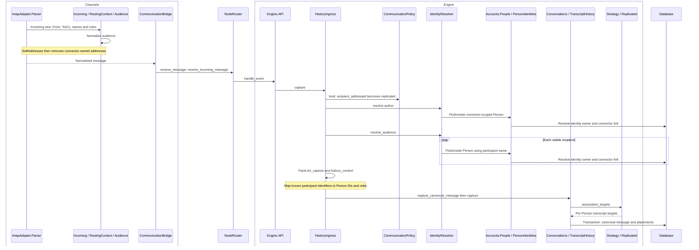
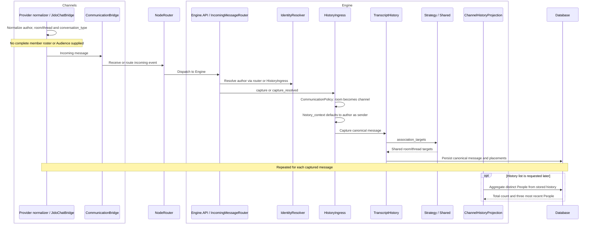
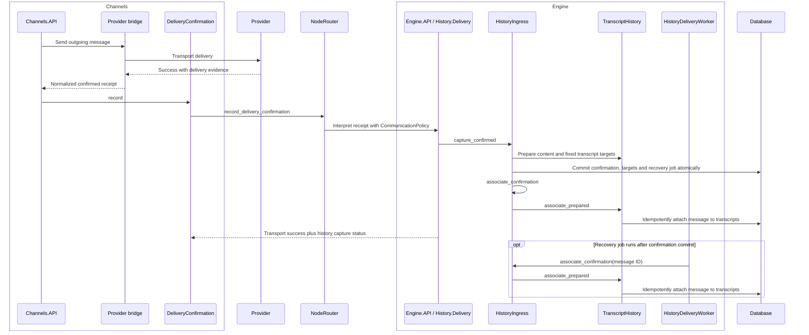

# Message Lifecycle Sequences

This guide traces the current communication paths across Channels, Engine and
Agent. It is a navigation aid, not a separate policy definition: domain contracts
remain in [Channels](channels.md), [Engine](engine.md) and [Agent](agent.md);
cross-service dispatch is owned by the
[architecture guide](../architecture.md#noderouter--critical).

Diagrams use shortened module names and group some helper calls. Boxes represent
execution roles, not a requirement for separate machines: `NodeRouter` selects a
local call or RPC according to deployment. Normalization of Engine-defined data
structs can execute on Channels before dispatch.

## Terms and module responsibilities

- **Identity:** a native identifier within a provider authority, owned by one Person.
- **Audience:** sender and visible recipients of one message, with optional names/roles;
  normalized evidence is not authentication.
- **Observed participant:** a Person referenced by captured message history, not
  necessarily every member of the room.
- **Membership:** room membership and its access lifecycle, separate from observed participants.
- **Placement:** the association of canonical message content with a transcript.
- **Confirmation:** evidence that transport accepted a delivery, separate from history association.

| Module(s) | Responsibility |
| --- | --- |
| `ImapAdapter.Parser`, provider-specific chat normalizers, `JidoChatBridge` | Extract transport facts; do not choose history strategy. |
| `Incoming`, `RoutingContext`, `Audience` | Normalize the consumer-neutral message contract and message-local evidence. |
| `EmailBridge.SelfAddresses` | Remove connector-owned addresses from incoming audience/reply targets. |
| `CommunicationBridge` | Dispatch passive receipt or response-requesting incoming events. |
| `IncomingMessageRouter`, `IncomingMessageRouting` | Resolve the author, choose routing, capture history, and admit Agent execution when selected. |
| `IdentityResolver`, `Accounts.People`, `PersonIdentities` | Resolve/discover People and enforce native identity ownership independently of connector links. |
| `HistoryIngress` | Validate capture scope, construct history facts/context, and own durable confirmation/recovery orchestration. |
| `History.CommunicationPolicy`, `History.Facts` | Interpret conversation characteristics and validate normalized history inputs. |
| `History.Strategy`, `Direct`, `Shared`, `Replicated` | Select transcript association targets and strategy-specific policy. |
| `Conversations`, `TranscriptHistory` | Persist canonical content and transcript placements with source/replay checks. |
| `ChannelHistoryProjection` | Derive observed participants and presentation summaries from stored history. |
| `DeliveryConfirmation` | Forward normalized transport receipts to Engine, preserving transport success. |
| `History.Delivery` | Interpret confirmed receipts using Engine history policy. |
| `HistoryDeliveryWorker` | Retry association by canonical message ID, without resending transport delivery. |

## Incoming routing overview

```mermaid
sequenceDiagram
    participant C as Channels / CommunicationBridge
    participant N as NodeRouter
    participant E as Engine.API / IncomingMessageRouter
    participant A as Agent.Api

    alt Response-requesting path
        C->>N: route_incoming_message event (sync Engine hop)
        N->>E: route
        E->>E: Resolve author, select routing, capture history
        alt Agent selected and execution admitted
            E->>E: Admit incoming execution; check duplicate
            E-->>N: Event: next_hop Agent, action run_pipeline
            N->>N: Schedule Agent hop (async by default)
            N-->>C: Dispatch result, not generated answer
            N->>A: run_pipeline in scheduled task
        else No Agent selected, duplicate, or error
            E-->>N: Terminal event without Agent hop
            N-->>C: Routing result
        end
    else Passive receipt
        C->>N: receive_incoming_message event
        N->>E: Capture supported history
        E-->>N: Terminal capture result
        N-->>C: Receipt result; no Agent execution
    end
```

Engine chooses the Agent hop; Channels does not initiate a second Agent dispatch.
The default asynchronous hop does not wait for generation. A synchronous Agent
hop can be explicitly selected. For execution/finalization and the Channels return
hop, see [Agent pipeline flow](agent.md#pipeline-flow).

Entry points:
[CommunicationBridge](../../lib/zaq/channels/communication_bridge.ex),
[IncomingMessageRouter](../../lib/zaq/engine/incoming_message_router.ex),
[NodeRouter](../../lib/zaq/node_router.ex).

## Incoming email

This sequence follows passive receipt. Response-requesting email uses the routing
overview above: the router resolves the author and enters `capture_resolved`, then
continues to execution admission if Agent routing is selected.



The audience arrives together for each email; later replies supply their own
audience. Visible To/Cc evidence is distinct from reply routing and hidden
recipients. Recipient identifiers drive discovery/placement; participant metadata
provides names and roles. Invalid evidence, identity conflicts and conflicting
source replays can stop capture. Transcript placement is not permission to assert
an arbitrary recipient.

Entry points:
[email parser](../../lib/zaq/channels/email_bridge/imap_adapter/parser.ex),
[Audience](../../lib/zaq/engine/messages/incoming/audience.ex),
[IdentityResolver](../../lib/zaq/people/identity_resolver.ex),
[PersonIdentities](../../lib/zaq/accounts/person_identities.ex),
[HistoryIngress](../../lib/zaq/engine/history_ingress.ex),
[TranscriptHistory](../../lib/zaq/engine/conversations/transcript_history.ex).

## Incoming chat rooms



Participants accumulate from captured messages, not a full member roster. Silent
members are not observed participants. The three-person list preview does not
cap the transcript's participant count or govern its grants. One-to-one chat
selects `Direct` rather than `Shared`. Agent continuation follows the incoming
routing overview; participant projection is a later read, not an ingress step.

Entry points:
[JidoChatBridge](../../lib/zaq/channels/jido_chat_bridge.ex),
[CommunicationPolicy](../../lib/zaq/engine/history/communication_policy.ex),
[Strategy](../../lib/zaq/engine/history/strategy.ex),
[ChannelHistoryProjection](../../lib/zaq/engine/channel_history_projection.ex).

## Outgoing delivery

This sequence assumes a normalized receipt marked `confirmation: :confirmed` and
an eligible history scope. Unconfirmed responses are not treated as confirmations;
direct/channel capture also requires the original execution message IDs.



Email placement uses confirmed delivery recipients; chat uses the original
execution scope. Preparation differs by history kind, but recovery always uses
the persisted message ID and fixed targets. It neither discovers a new audience
nor resends the transport message. Immediate association and the recovery job are
idempotent; the diagram does not imply that the worker waits for the immediate
attempt to finish.

Transport success survives downstream reporting/association failure. If
confirmation recording fails, the receipt reports unavailability; durable recovery
is only guaranteed after the confirmation transaction commits. Conflicting
confirmation evidence fails rather than replacing the recorded scope.

Entry points:
[DeliveryConfirmation](../../lib/zaq/channels/delivery_confirmation.ex),
[History.Delivery](../../lib/zaq/engine/history/delivery.ex),
[HistoryIngress](../../lib/zaq/engine/history_ingress.ex),
[HistoryDeliveryWorker](../../lib/zaq/engine/history_delivery_worker.ex).
