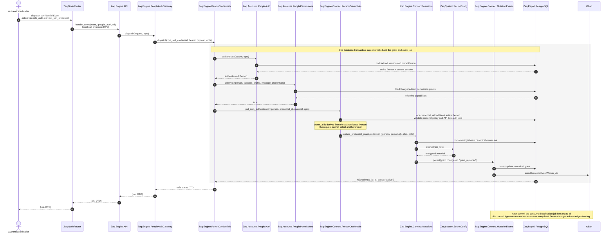
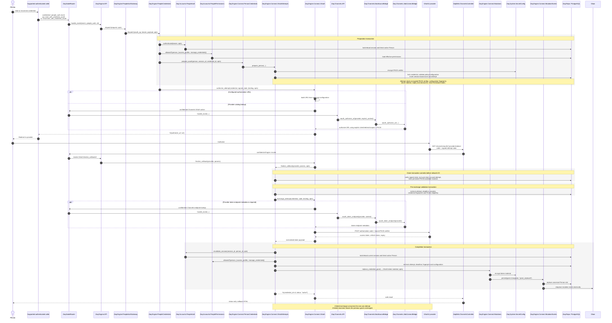
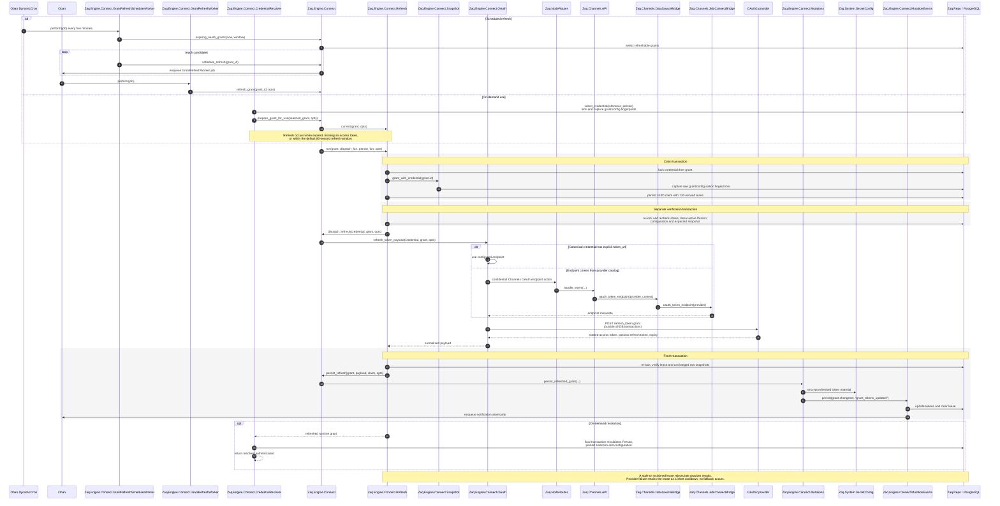
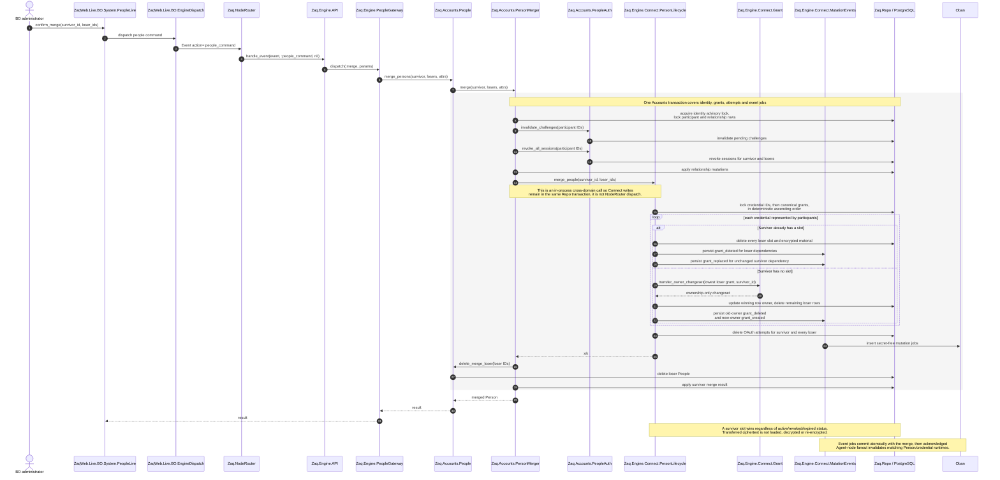
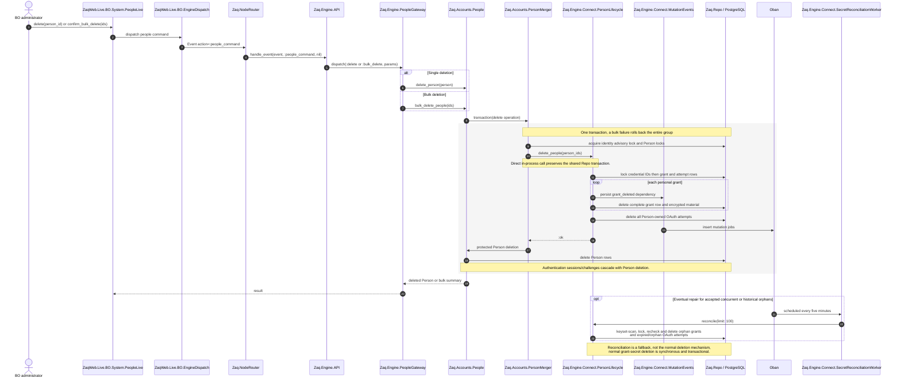

# Personal Grant Sequences

These diagrams describe the current Person-scoped Connect implementation. Participants
are code modules or external systems; arrows name the relevant public or coordinating
function. The diagrams deliberately expose transaction and network boundaries so the
module split can be reviewed.

There is currently no production People UI or Person-facing HTTP route for creating a
personal grant. The first hop in the creation diagrams is therefore the supported
confidential Engine event boundary rather than an invented screen. OAuth callback
handling does have a production controller route.

## 1. A Person adds a personal grant

### 1A. API key

API-key submission does not call the provider. Validation is structural and policy-based;
it is not proof that the key works remotely.

### 1B. OAuth2 grant

The important split is that Channels supplies authorization/provider metadata while
Engine owns the canonical token POST and grant persistence. No provider network call is
made while a database transaction is open.

## 2. A personal OAuth2 token is refreshed

The scheduler and resolver converge on one refresh protocol. The resolver adds selection
checks before and after refresh; the scheduled path refreshes the grant directly.

## 3. A Person with personal grants is merged

All in-flight OAuth attempts for every original participant are cancelled rather than
rebound. Consequently, even a callback already performing provider HTTP cannot save after
the lifecycle transaction removes its persisted attempt.

## 4. A Person is removed

## Boundary assessment

| Boundary | Assessment |
| --- | --- |
| `NodeRouter` → `Engine.API` → fixed gateway | Sound. Cross-role routing and operation allowlisting remain outside credential-domain code. Confidential routing suppresses secret-bearing workflow broadcasts. |
| `PeopleAuthGateway` → `PeopleCredentials` | Sound. The gateway is a narrow transport dispatcher; `PeopleCredentials` owns the authenticated use case and returns fixed safe DTOs/errors. |
| `PeopleCredentials` → Accounts auth/permissions + Connect domain | Sound application-service split. Authentication and authorization happen before the Person is converted into a domain argument, while ownership is always server-derived. |
| `PersonCredentials` → `Mutations` | Sound. Person eligibility and ownership policy are separate from the canonical lock/encrypt/write/event transaction used by other trusted callers. |
| `OAuthAttempts` → `OAuth` | Sound security boundary, though `OAuthAttempts` is intentionally a substantial coordinator. One-use state and repeated database validation surround provider I/O without holding locks over the network. |
| `OAuth` → Channels modules | Mostly sound but asymmetric. Channels resolves provider authorization/endpoint behavior; Engine performs canonical exchange/refresh HTTP. The split avoids ambient provider credentials, but should remain explicit because “Channels OAuth” does not mean Channels owns token transport. |
| `CredentialResolver` → `Refresh` → `Mutations` | Sound. Selection, lease/snapshot protocol, provider transport and persistence are separately testable; final resolver revalidation prevents a refreshed stale selection from being returned. |
| `PersonMerger`/`People` → `PersonLifecycle` | Deliberate but architecturally sharp. Accounts depends directly on an Engine Connect lifecycle module. This preserves one database transaction and prevents identity deletion from racing secret cleanup; replacing it with `NodeRouter` would break that atomicity. If the dependency direction becomes problematic, move orchestration to a higher in-process lifecycle coordinator rather than introducing RPC. |
| `MutationEvents` → Oban worker → Agent fanout | Sound eventual invalidation boundary: domain writes and outbox jobs commit together; the worker requires acknowledgments from every discovered Agent node after synchronous local fencing. Partitions and undiscovered owners remain the explicit #775 infrastructure scope. |
| Production Person caller → credential gateway | Incomplete integration rather than a bad internal split. The authenticated backend boundary exists, but no Person-facing start/write route or UI currently invokes it. |

## Source entry points

- [`lib/zaq/engine/people_auth_gateway.ex`](../../lib/zaq/engine/people_auth_gateway.ex)
- [`lib/zaq/engine/people_credentials.ex`](../../lib/zaq/engine/people_credentials.ex)
- [`lib/zaq/engine/connect/person_credentials.ex`](../../lib/zaq/engine/connect/person_credentials.ex)
- [`lib/zaq/engine/connect/oauth_attempts.ex`](../../lib/zaq/engine/connect/oauth_attempts.ex)
- [`lib/zaq/engine/connect/refresh.ex`](../../lib/zaq/engine/connect/refresh.ex)
- [`lib/zaq/engine/connect/credential_resolver.ex`](../../lib/zaq/engine/connect/credential_resolver.ex)
- [`lib/zaq/engine/connect/person_lifecycle.ex`](../../lib/zaq/engine/connect/person_lifecycle.ex)
- [`lib/zaq/accounts/person_merger.ex`](../../lib/zaq/accounts/person_merger.ex)
- [`lib/zaq/accounts/people.ex`](../../lib/zaq/accounts/people.ex)
